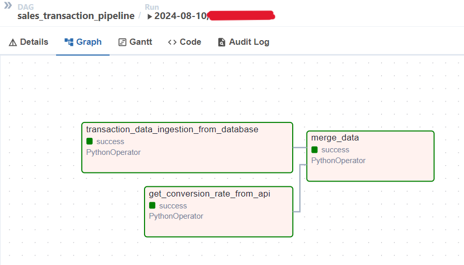

# Airflow on Docker

```bash
mkdir airflow_on_docker
cd airflow_on_docker
curl -LfO 'https://airflow.apache.org/docs/apache-airflow/stable/docker-compose.yaml'
code .
mkdir ./dags ./logs ./plugins ./data
echo -e "AIRFLOW_UID=$(id -u)\nAIRFLOW_GID=0" > .env
```

#### Built docker image to install libraries from a requirements.txt 
```bash
docker build -t apache/airflow:2.9.3 . 
```

#### Initialize the database and create a user
```bash
docker compose up airflow-init
```

#### Start all services
```bash
docker compose up
```

#### Stop , delete containers , delete volumes with database data and download images
```bash
docker compose down --volumes --rmi all
```

## Reference
https://airflow.apache.org/docs/apache-airflow/stable/howto/docker-compose/index.html
<br><br><br>

### Graph View of the Tasks in a DAG
 <br>
- __transaction_data_ingestion_from_database__ : Ingest sales transaction data from the MySQL database and save it as a CSV file
- __get_conversion_rate_from_api__ : Send a request to get conversion rate data from the API and save it as a CSV file
- __merge_data__ : Merge data from the previous tasks, convert the currency from GBP to THB, adjust columns, and save the result as a CSV file
#### Result of the DAG
 <br>
